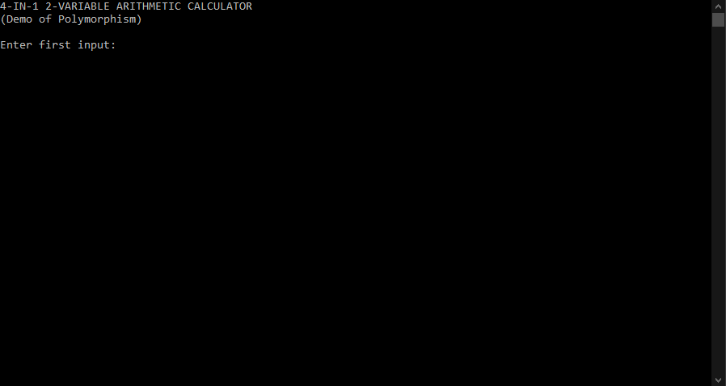

# (C++ Polymorphism Demo): 4-in-1 2-Variable Arithmetic Calculator

-This program was made to demonstrate the functionality of Polymorphism 

-The program contains 2 variables which accept user-input to perform the calculations

-Outputs for the sum, difference, product and quotient are displayed in the console

# Demonstration of Code:

